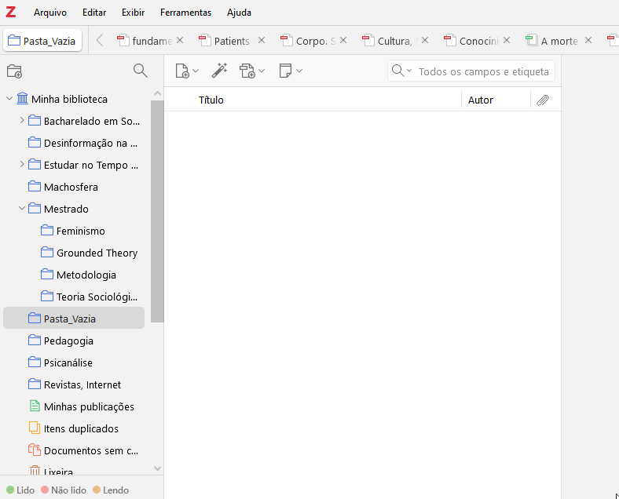

## Sobre os ministrantes:

<div style="margin:0.35em 0; padding:0; line-height:1.15;">
<span style="font-size:0.80em;"><strong>• Arthur</strong> – <a href="https://labhdufba.github.io/pt/authors/11_arthur/">Graduando em Ciências Sociais</a></span>
</div>

<div style="margin:0.35em 0; padding:0; line-height:1.15;">
<span style="font-size:0.80em;"><strong>• Thibau</strong> – <a href="https://labhdufba.github.io/pt/authors/10_thibau/">Mestrando em Ciências Sociais</a></span>
</div>

<div style="margin:0.35em 0; padding:0; line-height:1.15;">
<span style="font-size:0.95em;">Pesquisadores do <a href="https://labhdufba.github.io/">Laboratório de Humanidades Digitais</a></span>
</div>

<p style="display:flex; justify-content:left;">


</p>


## <span style="font-size:0.85em;">O que é isso? “Zotero”</span>

<div style="margin:0.35em 0; padding:0; line-height:1.15;">
<span style="font-size:0.55em;"><strong>Seu objetivo</strong> é auxiliar pesquisadores, estudantes e profissionais a coletar, organizar, citar e compartilhar fontes de informação.</span>
</div>

<div style="margin:0.35em 0; padding:0; line-height:1.15;">
<span style="font-size:0.5em;">•</span>
<span style="font-size:0.55em;"><strong>Banco de dados de referências bibliográficas</strong></span><br>
<span style="font-size:0.5em;">Funciona como repositório tanto para ARQUIVOS quanto para REFERÊNCIAS</span>
</div>

<div style="margin:0.35em 0; padding:0; line-height:1.15;">
<span style="font-size:0.5em;">•</span>
<span style="font-size:0.55em;">Permite criar bibliotecas, coleções e grupos colaborativos</span>
</div>

<div style="margin:0.35em 0; padding:0; line-height:1.15;">
<span style="font-size:0.5em;">•</span>
<a href="https://www.zotero.org/groups/5733525/humanidades_digitais_ufba" style="font-size:0.55em; color:#0040ff;"><strong>Rede Social</strong></a><br>
<span style="font-size:0.5em;">Possibilita interação acadêmica e criação de grupos públicos ou privados</span>
</div>


## Preparando a Máquina

<div style="margin:0.35em 0; padding:0; line-height:1.15;">
[<span style="font-size:0.55em;"><strong>Script para Ativar Windows e Pacote Office</strong></span>](https://github.com/massgravel/Microsoft-Activation-Scripts)
</div>

<div style="margin:0.35em 0; padding:0; line-height:1.15;">
<span style="font-size:0.55em;"><strong>Paraíso dos Textos Acadêmicos:</strong> <a href="https://annas-archive.org/"><strong>Annas-archive</strong></a> e <strong>Nexus Search</strong></span><br>

<video src="https://raw.githubusercontent.com/l-thibau/Slides/thibau/Zotero/NexusSearch.mp4" width="700" controls></video>

</div>

## Diferença entre Mendeley e Zotero

<div class="curiosidade-tab">

  <span class="curiosidade-button">💡 Curiosidade</span>
  <div class="curiosidade-box">
    A Elsevier comprou o Mendeley em 2013 por cerca de 50 milhões de euros.
    A aquisição gerou críticas na comunidade acadêmica pelo possível conflito entre o modelo corporativo da Elsevier e o ethos colaborativo original.
  </div>

  <span class="curiosidade-button">Software Livre</span>
  <div class="curiosidade-box">
    Concede liberdade para executar, acessar e modificar o código-fonte e redistribuir cópias com ou sem alterações.
    Pode ser usado, estudado, modificado e compartilhado sem restrições.
  </div>

  <span class="curiosidade-button">Dependência</span>
  <div class="curiosidade-box">
    Em 2018, uma atualização do Mendeley provocou perda de PDFs e anotações para alguns usuários.
    A Elsevier corrigiu o problema após algumas semanas.
  </div>

</div>

<div style="margin:0.35em 0; padding:0; line-height:1.15;">
<span style="font-size:0.5em;">•</span>
<span style="font-size:0.55em;"><strong>Empresarial</strong></span>
<span style="font-size:0.5em;">Vs Software Livre (É seu)</span>
</div>

<div style="margin:0.35em 0; padding:0; line-height:1.15;">
<span style="font-size:0.5em;">•</span>
<span style="font-size:0.55em;"><strong>Elsevier (código fechado)</strong></span>
<span style="font-size:0.5em;">vs Código aberto</span>
</div>

<div style="margin:0.35em 0; padding:0; line-height:1.15;">
<span style="font-size:0.5em;">•</span>
<span style="font-size:0.55em;"><strong>A empresa gestiona os dados</strong></span>
<span style="font-size:0.5em;">Vs Você é o responsável</span>
</div>


## Mas e o que isso tem de mais?

<div style="margin:0.35em 0; line-height:1.15;">
<span style="font-size:0.7em;">• Tudo em um <strong>único app</strong></span><br>
<span style="font-size:0.7em;">• Organiza <strong>todas suas referências</strong> (Metadados!)</span><br>
<span style="font-size:0.7em;">• Permite <strong>linkar a relação</strong> dos arquivos</span><br>
<span style="font-size:0.7em;">• <strong>Marcar</strong> e inserir <strong>notas</strong></span><br>
<span style="font-size:0.7em;">• Formar <strong>Mapa mental e Gráfico de Rede</strong></span><br>
<span style="font-size:0.7em;">• <strong>Etiquetar</strong> textos</span><br>
<span style="font-size:0.7em;">• Criar grupos e realizar <a href="https://www.youtube.com/watch?v=KVoqUnN17ZY" style="color:#0040ff;"><strong>revisões sistemáticas</strong></a></span><br>
<span style="font-size:0.7em;">• <strong>E muito mais :D</strong></span>
</div>


## Conhecendo a ferramenta

<div style="margin:0.35em 0; line-height:1.15;">
<span style="font-size:0.55em;"><strong>Painel Esquerdo:</strong> Coleções e grupos.</span><br>
<span style="font-size:0.55em;"><strong>Painel Central:</strong> Referências da coleção selecionada.</span><br>
<span style="font-size:0.55em;"><strong>Painel Direito:</strong> Metadados, notas e tags.</span>
</div>

{width="50px"}


## Logando no app

<video src="https://raw.githubusercontent.com/l-thibau/Slides/thibau/Zotero/LogandoZotero.mp4" width="700" controls></video>


## Cadastrando Artigos e Livros

###### **Obtendo metadados**

<a href="https://chromewebstore.google.com/detail/zotero-connector/ekhagklcjbdpajgpjgmbionohlpdbjgc?pli=1/" target="_blank">
 </a>

- **Varinha Mágica (DOI ou ISBN)**

{width=430}


## Outros métodos de importação

- Metadados pelo **Zotero Connector**:

<video src="https://raw.githubusercontent.com/l-thibau/Slides/thibau/Zotero/zotero%20connector.mp4" width="687" controls></video>

- **Em alguns casos**: simplesmente arrastar um arquivo para o Zotero


## Motor de busca

**Tags, Notas e Busca avançada**


## <span style="font-size:0.85em;">Extensões Recomendadas</span> 

<div style="margin:0.05em 0; padding:0; line-height:1.1;"> <span style="font-size:0.5em;">•</span> [<span style="font-size:0.55em;">**Better Notes**</span>](https://github.com/windingwind/zotero-better-notes?tab=readme-ov-file) <span style="font-size:0.55em;">|</span> <span style="font-size:0.55em;"><a href="https://youtu.be/p1d7sR9KssU?si=VoV54XfHbM6U6TIQ" style="color:#005000;"><strong>Clique aqui para o guia</strong></a></span><br> <span style="font-size:0.5em;">Excelente para personalizar e expandir suas anotações dentro do Zotero, permitindo painéis avançados, bundles, templates e organização aprimorada</span> </div> <div style="margin:0.05em 0; padding:0; line-height:1.1;"> <span style="font-size:0.5em;">•</span> [<span style="font-size:0.55em;">**Attanger**</span>](https://github.com/MuiseDestiny/zotero-attanger/releases)<br> <span style="font-size:0.5em;">Essencial para integrar na Cloud e renomear arquivos em massa com formatações sofisticadas</span> </div> <div style="margin:0.05em 0; padding:0; line-height:1.1;"> <span style="font-size:0.5em;">•</span> [<span style="font-size:0.55em;">**PDF Translate**</span>](https://github.com/windingwind/zotero-pdf-translate/releases) <span style="font-size:0.55em;">|</span> <span style="font-size:0.55em;"><a href="https://www.youtube.com/watch?v=AgXUmwLP1vM" style="color:#005000;"><strong>Clique aqui para o guia</strong></a></span><br> <span style="font-size:0.5em;">Permite traduzir PDFs diretamente dentro do Zotero com suporte a vários motores de tradução</span> </div> <div style="margin:0.05em 0; padding:0; line-height:1.1;"> <span style="font-size:0.5em;">•</span> [<span style="font-size:0.55em;">**ShortDOI**</span>](https://github.com/bwiernik/zotero-shortdoi/releases/tag/v1.5.0)<br> <span style="font-size:0.5em;">Gera automaticamente versões curtas de DOIs, facilitando citações e compartilhamento</span> </div> <div style="margin:0.05em 0; padding:0; line-height:1.1;"> <span style="font-size:0.5em;">•</span> [<span style="font-size:0.55em;">**Zotero OCR**</span>](https://github.com/UB-Mannheim/zotero-ocr/releases/tag/0.9.3) <span style="font-size:0.55em;">|</span> <span style="font-size:0.55em;"><a href="https://www.youtube.com/watch?v=swKQXs1vqZo" style="color:#005000;"><strong>Clique aqui para o guia</strong></a></span><br> <span style="font-size:0.5em;">Aplica OCR a PDFs (Transforma Imagens em Texto)… Requer <a href="https://github.com/UB-Mannheim/tesseract/wiki">Tesseract.exe</a> e <a href="https://github.com/oschwartz10612/poppler-windows/releases/">Poppler</a></span> 
</div>
<div style="margin:0.05em 0; padding:0; line-height:1.1;">
  <span style="font-size:0.5em;">•</span>
  <span style="font-size:0.55em;">
    <a href="https://github.com/lifan0127/ai-research-assistant" style="color:#0044cc;">
      <strong>Zotero AI</strong>
    </a>
  </span>
  <span style="font-size:0.55em;">|</span>
  <span style="font-size:0.55em;">
    <a href="https://www.youtube.com/watch?v=2-c60WOChlg" style="color:#005000;">
      <strong>Clique aqui para o guia</strong>
    </a>
  </span><br>
  <span style="font-size:0.5em;">
    Integra modelos de linguagem ao Zotero, permitindo gerar resumos, extrair conceitos-chave, criar anotações inteligentes e auxiliar na organização bibliográfica diretamente no fluxo de leitura
  </span>
</div>

## Instalando no Word e LibreOffice


{width=430}


## Caso precise corrigir o Word:

::: {style="display: flex; align-items: center;"}

<video src="https://raw.githubusercontent.com/l-thibau/Slides/thibau/Zotero/FixWord.mp4" width="40%" controls></video>

::: {style="font-size: 0.35em; padding-right: 250px;"}
[Em resumo:](https://youtu.be/6GTqQU-8jcM?si=_d6J2ZUyILEj5Unl&t=140)

> Ir ao endereço:  
> `C:\Program Files (x86)\Zotero\integration\word-for-windows`  
> Copiar o arquivo Zotero.dotm  
> Colar em: `%appdata%\microsoft\word\startup`
:::
:::

## Inserindo as Referências

- [**Formatação recomendada**](https://planetazotero.blogspot.com/2020/04/estilo-da-norma-abnt-2018-para-o-zotero.html)

- [**Docs**](https://www.youtube.com/watch?v=YA-Lq0VpvQA)

- Caso esteja em um Docs colaborativo:

<video src="https://raw.githubusercontent.com/l-thibau/Slides/thibau/Zotero/docscolaborativo.mp4" width="800" controls></video>

## Renomeando todos os arquivos

- Pode personalizar como quiser!  
  *Exemplo:*  
  `rename {{ authors name="family_given" initialize="_" join="_" suffix="_" }}{{ year suffix="_" }}{{ title truncate="100"}}`

<video src="https://raw.githubusercontent.com/l-thibau/Slides/thibau/Zotero/Renomeando.mp4" width="565" controls></video>


## Integrando com Google Drive

- [Tutorial Antigo](https://www.youtube.com/watch?v=n4fQPoy7GqU&ab_channel=Singularidade)  {width="46"}

- **Configurando Attanger**
<br>
<video src="https://raw.githubusercontent.com/l-thibau/Slides/thibau/Zotero/Attanger.mp4" width="650" controls></video>


## Transferindo tudo ao Drive

<video src="https://raw.githubusercontent.com/l-thibau/Slides/thibau/Zotero/Transferindo.mp4" width="730" controls></video>

## E em Tablet?  Consigo usar?!
<br>
Sim! Porém, **não tenho experiência de uso**.

<div style="display: flex; align-items: center; justify-content: left;">
  
</div>

Discussões que esclarecem bem sobre como proceder com a leitura de textos do Zotero em Android e IOS:
<br><br>
[1](https://www.reddit.com/r/zotero/comments/1bc620f/tablet_for_zotero/) e [2](https://www.reddit.com/r/zotero/comments/jq9al0/sync_between_zotero_and_android_tablet/?tl=pt-br)


## Muito obrigado pela atenção

- **Bons estudos!**

::: {style="display: flex; align-items: center;"}

:::


```{=html}
<style>
.reveal .slide-number {
  font-size: 46px;
  color: #333;
}
</style>
<script>
document.addEventListener("DOMContentLoaded", function () {

  // Pega todos os botões
  const buttons = document.querySelectorAll(".curiosidade-button");

  buttons.forEach(button => {
    button.addEventListener("click", function (event) {
      event.stopPropagation();

      const box = this.nextElementSibling;
      const isOpen = box.style.display === "block";

      // Fecha todas as caixas
      document.querySelectorAll(".curiosidade-box").forEach(b => b.style.display = "none");

      // Remove active de todos os botões
      document.querySelectorAll(".curiosidade-button").forEach(btn => btn.classList.remove("active"));

      // Abre a caixa clicada e ativa o botão
      if (!isOpen) {
        box.style.display = "block";
        this.classList.add("active");
      }
    });
  });

  // Clicou fora → fecha tudo e reseta botões
  document.addEventListener("click", () => {
    document.querySelectorAll(".curiosidade-box").forEach(b => b.style.display = "none");
    document.querySelectorAll(".curiosidade-button").forEach(btn => btn.classList.remove("active"));
  });

});
</script>


