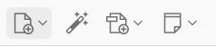
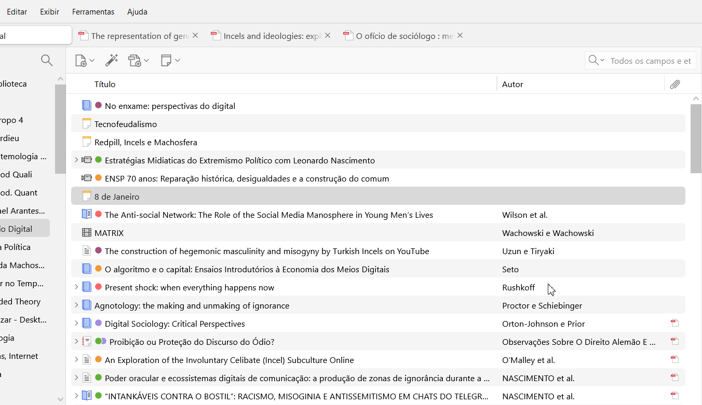
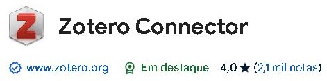
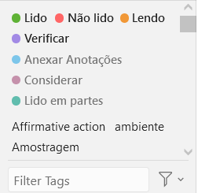
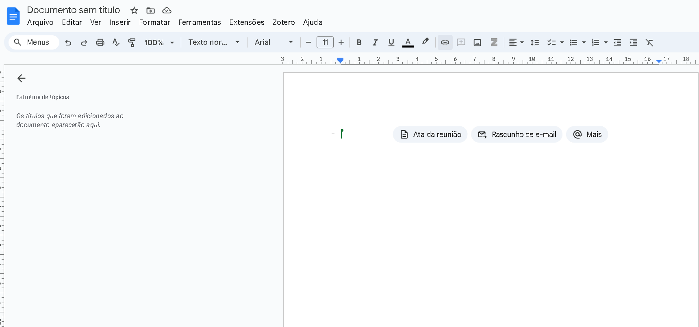
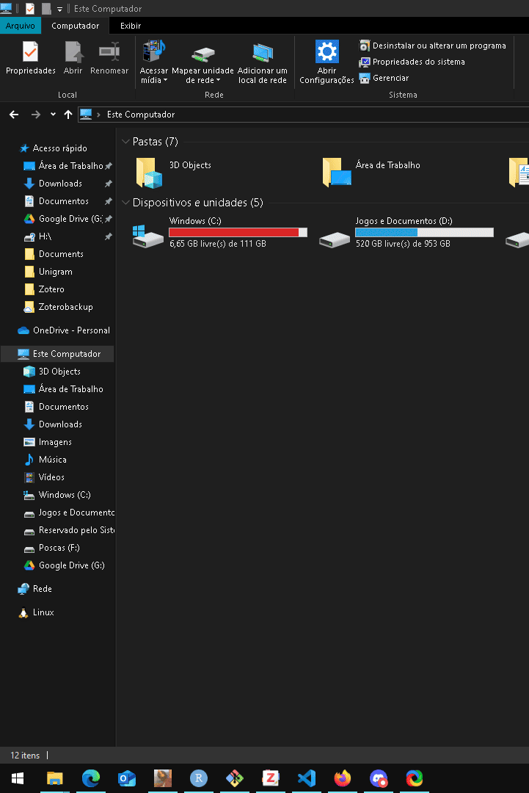
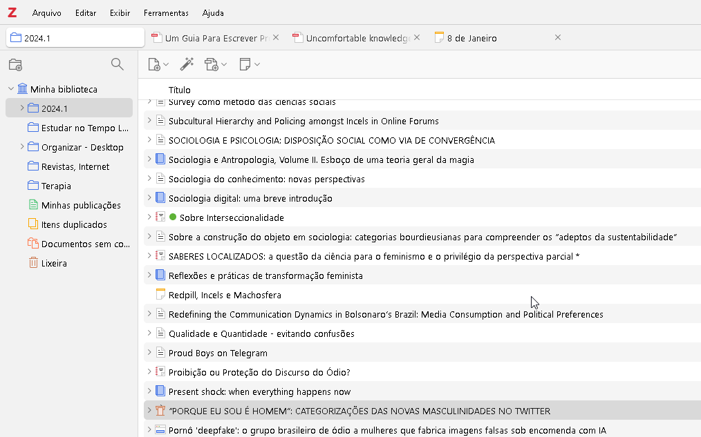
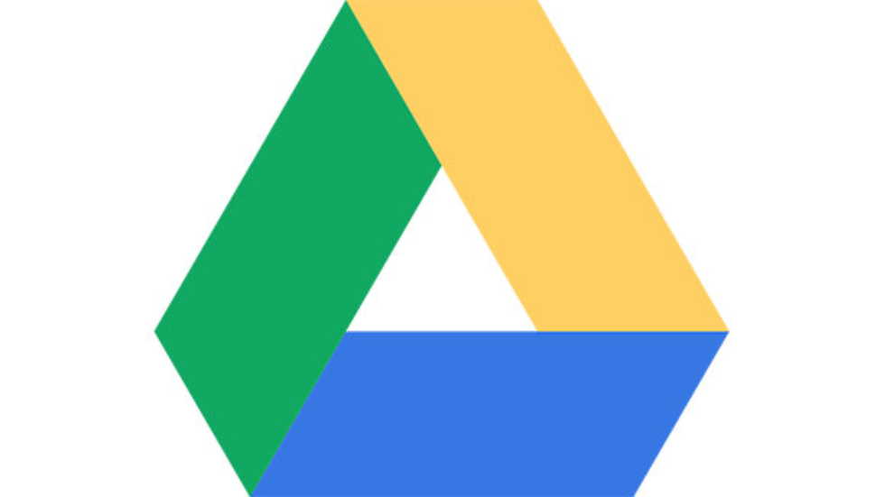
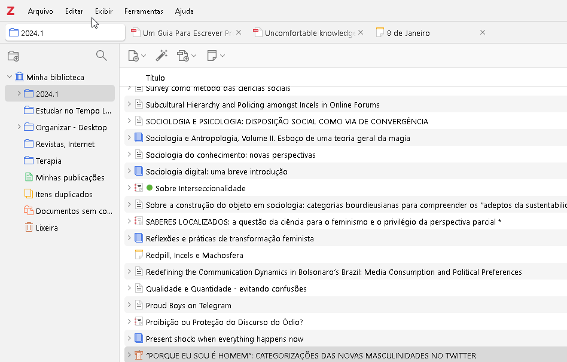
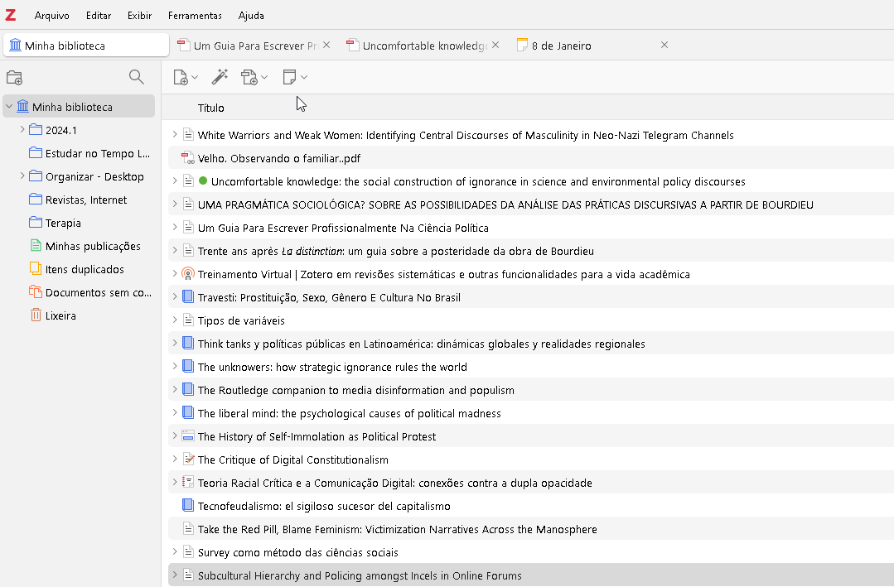

## Sobre os ministrantes:

-   ****
    -   Arthur - [Graduando em Ciências Sociais](https://labhdufba.github.io/pt/authors/11_arthur/)
    -   Thibau -  [Mestrando em Ciências Sociais](https://labhdufba.github.io/pt/authors/10_thibau/)
    -   Pesquisadores do [Laboratório de Humanidades
        Digitais](https://labhdufba.github.io/). <!-- Inserir foto -->

<p style="display: flex; justify-content: center;">


</p>

## <span style="font-size:0.85em;">O que é isso? “Zotero”</span>

<div style="margin:0.35em 0; padding:0; line-height:1.15;">
<span style="font-size:0.55em;"><strong>Seu objetivo</strong> é auxiliar pesquisadores, estudantes e profissionais a coletar, organizar, citar e compartilhar fontes de informação.</span>
</div>

<div style="margin:0.35em 0; padding:0; line-height:1.15;">
<span style="font-size:0.5em;">•</span>
<span style="font-size:0.55em;"><strong>Banco de dados de referências bibliográficas</strong></span><br>
<span style="font-size:0.5em;">Funciona como repositório tanto para ARQUIVOS quanto para REFERÊNCIAS</span>
</div>

<div style="margin:0.35em 0; padding:0; line-height:1.15;">
<span style="font-size:0.5em;">•</span>
<span style="font-size:0.55em;">Permite criar bibliotecas, coleções e grupos colaborativos</span>
</div>

<div style="margin:0.35em 0; padding:0; line-height:1.15;">
<span style="font-size:0.5em;">•</span>
<a href="https://www.zotero.org/groups/5733525/humanidades_digitais_ufba" style="font-size:0.55em; color:#0040ff;"><strong>Rede Social</strong></a><br>
<span style="font-size:0.5em;">Possibilita interação acadêmica e criação de grupos públicos ou privados</span>
</div>


## Preparando a Máquina

-   [**Script para Ativar Windows e Pacote
    Office**](https://github.com/massgravel/Microsoft-Activation-Scripts)

-   **Paraíso dos Textos Acadêmicos:
    [Annas-archive](https://annas-archive.org/) e Nexus Search**
    
    <!-- Ajustar gif colocando a aba nexus no futuro -->

## Diferença entre Mendeley e Zotero

<div style="margin:0.35em 0; padding:0; line-height:1.15;">
<span style="font-size:0.5em;">•</span>
<span style="font-size:0.55em;"><strong>Empresarial</strong></span>
<!-- Mendeley é uma empresa sediada em Londres, Reino Unido, que desenvolve produtos e serviços para pesquisadores acadêmicos. -->
<span style="font-size:0.5em;">Vs Software Livre (É seu)</span>
<!-- concede liberdade ao usuário para executar, acessar e modificar o código fonte, e redistribuir cópias com ou sem modificações; pode ser usado, copiado, estudado, modificado e redistribuído sem nenhuma restrição. -->
</div>

<div style="margin:0.35em 0; padding:0; line-height:1.15;">
<span style="font-size:0.5em;">•</span>
<span style="font-size:0.55em;"><strong>Elsevier (código fechado)</strong></span>
<!-- a Elsevier comprou a Mendeley.; O valor do negócio foi estimado em 50 milhões de Euros. [8] A venda levou a um debate em redes científicas e na mídia interessada pelo acesso aberto. A aquisição seria antiética para o modelo colaborativo da Mendeley -->
<span style="font-size:0.5em;">vs Código aberto</span>
<!-- disponibilizado gratuitamente para consulta, examinação, modificação e redistribuição. O modelo de código aberto é um modelo de desenvolvimento de software descentralizado que incentiva a colaboração aberta.  É produzido pelo Centro de História e Novas Mídias da Universidade de George Mason, desde 2006 -->
</div>

<div style="margin:0.35em 0; padding:0; line-height:1.15;">
<span style="font-size:0.5em;">•</span>
<span style="font-size:0.55em;"><strong>A empresa gestiona os dados</strong></span>
<!-- Incidentes: Em 2018, uma atualização do Mendeley resultou na perda de PDFs e anotações nas contas de alguns usuários. A Elsevier consertou o problema para a maioria dos usuários após algumas semanas. -->
<span style="font-size:0.5em;">Vs Você é o responsável</span>
<!-- Google drive, por exemplo -->
</div>


## Mas e o que isso tem de mais?

-   Tudo em um **único app**
-   Organiza **todas suas referências: Metadados!**
-   Permite **linkar a relação** dos arquivos
-   **Marcar** e inserir **notas**!
-   Formar **Mapa mental e Rede Neural**
-   **Etiquetar** os textos <!-- ensinar a função das etiquetas -->
-   Criar Grupos e realizar **revisões sistemáticas**
-   E muito mais :D

## Conhecendo a ferramenta

-   **Painel Esquerdo:** Aqui você verá suas coleções (pastas) e grupos.
    É onde você pode organizar suas referências.

-   **Painel Central:** Exibe as referências que estão na coleção
    selecionada. Você pode ver detalhes sobre cada referência aqui.

-   **Painel Direito:** Mostra informações detalhadas da referência
    selecionada, como autores, título, data, e opções para adicionar
    notas e tags.

    {width="299" height="66"}

## Logando no app




## Cadastrando Artigos e Livros

###### **Obtendo metadados**

<a href="https://chromewebstore.google.com/detail/zotero-connector/ekhagklcjbdpajgpjgmbionohlpdbjgc?pli=1/" target="_blank">
 </a>
<!-- MENCIONAR TAMBÉM SOBRE O USO EM VIDEOS DO YOUTUBE -->

-   **Varinha Mágica (DOI ou ISBN)**
    <!-- Incentivar que pausem para fazer isso, e depois disso solicitar que façam manualmente a inserção de um meta-dado, ensinando depois a arrastar anexos para tal!-->

    

## Outros métodos de importação

-   Metadados pelo **Zotero Connector**:
    <!-- às vezes, como no caso do scielo, o arquivo vem junto dos dados. às vezes só os dados chegam. Portanto, é preciso baixar o arquivo e anexar nos dados! -->

    {width="687"}

-   **Em alguns casos**: simplesmente arrastar um arquivo para o Zotero

## Motor de busca

**Tags, Notas e Busca avançada**



## <span style="font-size:0.85em;">Extensões Recomendadas</span>

<div style="margin:0.05em 0; padding:0; line-height:1.1;">
<span style="font-size:0.5em;">•</span>
[<span style="font-size:0.55em;">**Better Notes**</span>](https://github.com/windingwind/zotero-better-notes?tab=readme-ov-file)
<span style="font-size:0.55em;">|</span>
<span style="font-size:0.55em;"><a href="https://youtu.be/p1d7sR9KssU?si=VoV54XfHbM6U6TIQ" style="color:#005000;"><strong>Clique aqui para o guia</strong></a></span><br>
<span style="font-size:0.5em;">Excelente para personalizar e expandir suas anotações dentro do Zotero, permitindo painéis avançados, bundles, templates e organização aprimorada</span>
</div>

<div style="margin:0.05em 0; padding:0; line-height:1.1;">
<span style="font-size:0.5em;">•</span>
[<span style="font-size:0.55em;">**Attanger**</span>](https://github.com/MuiseDestiny/zotero-attanger/releases)<br>
<span style="font-size:0.5em;">Essencial para integrar na Cloud e renomear arquivos em massa com formatações sofisticadas</span>
</div>

<div style="margin:0.05em 0; padding:0; line-height:1.1;">
<span style="font-size:0.5em;">•</span>
[<span style="font-size:0.55em;">**PDF Translate**</span>](https://github.com/windingwind/zotero-pdf-translate/releases)
<span style="font-size:0.55em;">|</span>
<span style="font-size:0.55em;"><a href="https://www.youtube.com/watch?v=AgXUmwLP1vM" style="color:#005000;"><strong>Clique aqui para o guia</strong></a></span><br>
<span style="font-size:0.5em;">Permite traduzir PDFs diretamente dentro do Zotero com suporte a vários motores de tradução</span>
</div>

<div style="margin:0.05em 0; padding:0; line-height:1.1;">
<span style="font-size:0.5em;">•</span>
[<span style="font-size:0.55em;">**ShortDOI**</span>](https://github.com/bwiernik/zotero-shortdoi/releases/tag/v1.5.0)<br>
<span style="font-size:0.5em;">Gera automaticamente versões curtas de DOIs, facilitando citações e compartilhamento</span>
</div>

<div style="margin:0.05em 0; padding:0; line-height:1.1;">
<span style="font-size:0.5em;">•</span>
[<span style="font-size:0.55em;">**Zotero OCR**</span>](https://github.com/UB-Mannheim/zotero-ocr/releases/tag/0.9.3)
<span style="font-size:0.55em;">|</span>
<span style="font-size:0.55em;"><a href="https://www.youtube.com/watch?v=swKQXs1vqZo" style="color:#005000;"><strong>Clique aqui para o guia</strong></a></span><br>
<span style="font-size:0.5em;">Aplica OCR a PDFs (Transforma Imagens em Texto)… Requer <a href="https://github.com/UB-Mannheim/tesseract/wiki">Tesseract.exe</a> e <a href="https://github.com/oschwartz10612/poppler-windows/releases/">Poppler</a></span>
</div>


## Inserindo as Referências

-   [**Formatação
    recomendada**](https://planetazotero.blogspot.com/2020/04/estilo-da-norma-abnt-2018-para-o-zotero.html):
    **Planeta Zotero**

-   [**Docs**](https://www.youtube.com/watch?v=YA-Lq0VpvQA) precisa da
    extensão do chrome\

-   Caso esteja em um Docs colaborativo:
    <!-- Lembre de falar de REFRESH + Edição das citações -->\
    {width="800"}

## Caso precise corrigir o Word:

::: {style="display: flex; align-items: center;"}


::: {style="font-size: 0.35em; padding-right: 250px;"}
[Em resumo:](https://youtu.be/6GTqQU-8jcM?si=_d6J2ZUyILEj5Unl&t=140)

> Ir ao endereço:
> `C:\Program Files (x86)\Zotero\integration\word-for-windows`\
> Copiar o arquivo Zotero.dotm\
> Apertar tecla Windows \> %appdata% \> microsoft \> word \> startup \>
> colar arquivo
:::
:::

## Renomeando todos os arquivos

-   Pode personalizar como quiser!\
    *Exemplo:*
    `rename {{ authors name="family_given" initialize="_" join="_" suffix="_" }}{{ year suffix="_" }}{{ title truncate="100"}}`

    {width="565"}

## Integrando com Google Drive

-   [Tutorial Antigo](https://www.youtube.com/watch?v=n4fQPoy7GqU&ab_channel=Singularidade)
    {width="46"}\
    [**Caso você já use o Zotero:** Lembre-se de fazer backup dos seus
    arquivos antes de iniciar o processo para garantir que nada se perca
    em caso de enganos.]{style="font-size: 0.7em;"}
-   **Configurando Attanger**

{width="456"}

## Transferindo tudo ao Drive

-   Enquanto renomeia!

    {width="729"}

## Muito obrigado pela atenção

-   **Bons estudos!** 

::: {style="display: flex; align-items: center;"}
{width="450"}
:::

```{=html}
<style>
.reveal .slide-number {
  font-size: 46px; /* Aumente o valor conforme necessário */
  color: #333; /* Cor da contagem de slides */
}
</style>
```


